# Zentra

The web home of **Zentra Protocol** — a zero-knowledge policy-enforcement layer
for autonomous AI agents on Stellar. This repo is the documentation site, the
marketing landing, an interactive proof playground, **and a live Stellar testnet
dApp**. Built on Fumadocs + Next.js, deployed on Vercel.

> Let agents act. Make them prove it.

**Live:** https://zentra-docs.vercel.app · **Testnet dApp:** https://zentra-docs.vercel.app/app

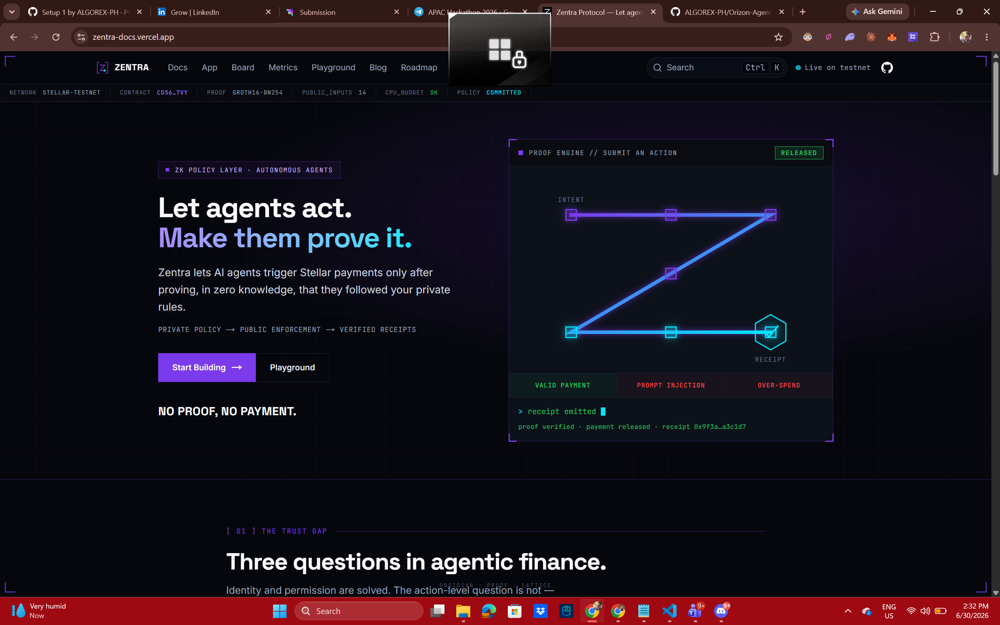

## 🥋 Hackathon belts — all four, in this one repo

This repository **is the submission for every belt (Levels 1–4)** — each belt is a
route in the same live product. Requirement-by-requirement coverage is in
**[`docs/BELT-CHECKLIST.md`](docs/BELT-CHECKLIST.md)**; per-belt detail is in the
sections below.

| Belt | Level | Route | On-chain contracts |
| --- | --- | --- | --- |
| 🥋 White | 1 — first Stellar dApp | [`/app`](https://zentra-docs.vercel.app/app) | — (classic XLM payments) |
| 🟡 Yellow | 2 — multi-wallet + deployed contract | [`/board`](https://zentra-docs.vercel.app/board) | `CDDIQNNC…K7VY` |
| 🟠 Orange | 3 — inter-contract + CI/CD + tests | [`/board`](https://zentra-docs.vercel.app/board) | `CCSXFTQT…ZDDES` + `CA2QOMGV…IIPI` |
| 🟢 Green | 4 — production MVP + analytics + feedback | [`/metrics`](https://zentra-docs.vercel.app/metrics) | `CC6S6CKP…F4CUG` + Neon Postgres |

Everything lives in **this** repo: contracts in [`contracts/`](contracts), the dApp
in [`src/`](src), tests + CI in [`.github/workflows/ci.yml`](.github/workflows/ci.yml),
and a real ZK proof playground at [`/playground`](https://zentra-docs.vercel.app/playground).

---

## Stellar White Belt — Testnet dApp (`/app`)

A first working Stellar dApp on **testnet**, wearing the Zentra brand. It is the
hands-on foundation the full Zentra proof layer builds on: connect a wallet, fund
it, read your balance, and send a real payment on the Stellar testnet.

### What it does

- **Connect / disconnect Freighter** through Stellar Wallets Kit, pinned to testnet.
- **Fund** a fresh account from Friendbot in one click.
- **Read & display** the connected account's native **XLM balance**, live.
- **Send XLM** to any address with amount + address validation.
- **Live transaction feedback** — building → awaiting signature → submitting →
  settled / failed, with the **transaction hash** linked to stellar.expert.
- **Friendly error handling** — unfunded account, non-existent destination,
  insufficient balance, and declined-signature are each surfaced in plain language.

### Level 1 requirements → where they live

| Requirement | Implementation |
| --- | --- |
| Freighter wallet, Stellar Testnet | `src/lib/stellar/kit.ts` (Wallets Kit, `Networks.TESTNET`) |
| Wallet connect / disconnect | `src/components/app/connect-button.tsx` + `wallet-provider.tsx` |
| Fetch + display XLM balance | `src/components/app/balance-card.tsx` + `src/lib/stellar/account.ts` |
| Send an XLM transaction | `src/components/app/send-form.tsx` + `src/lib/stellar/payment.ts` |
| Transaction feedback (success/fail + hash) | `src/components/app/tx-status.tsx` |
| Error handling | `src/lib/stellar/errors.ts` |

### Run it locally

Prerequisites: [Bun](https://bun.sh) ≥ 1.3, Node ≥ 20, and the
[Freighter](https://www.freighter.app) browser extension set to **Test Net**.

```bash
bun install
bun run dev        # http://localhost:3000/app
```

1. Open `/app` and click **Connect Wallet**, then approve in Freighter.
2. If the account is brand new, click **Fund** to seed it from Friendbot.
3. Enter a destination `G…` address and an amount, then click **Send XLM**.
4. Approve the signature — the settled transaction hash links to stellar.expert
   so anyone can verify it on-chain.

### Screenshots

| Wallet connected | Balance displayed |
| --- | --- |
| 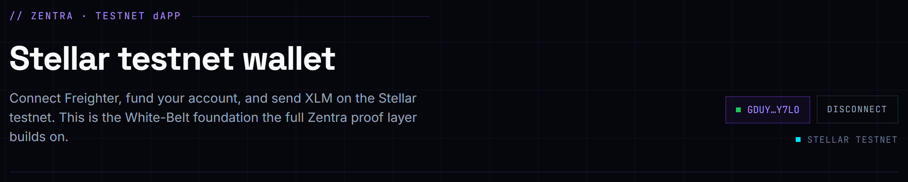 | 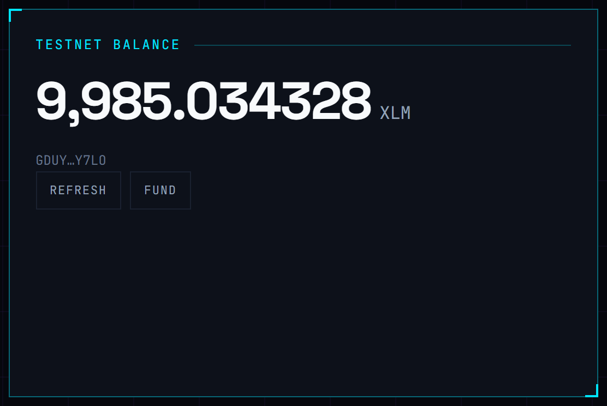 |

| Successful testnet transaction | Result shown to the user |
| --- | --- |
|  |  |

---

## Stellar Yellow Belt — On-chain Action Board (`/board`)

A multi-wallet dApp backed by a **Soroban smart contract deployed to testnet**.
Record a message to the on-chain action log, then watch entries stream into a
live feed driven by contract events.

- **Live:** https://zentra-docs.vercel.app/board
- **Contract:** [`CDDIQNNCZ23UVM4FTEKNFUB72WHNASWOX2JRXED3HYK6FNZGZCHBQFK7`](https://stellar.expert/explorer/testnet/contract/CDDIQNNCZ23UVM4FTEKNFUB72WHNASWOX2JRXED3HYK6FNZGZCHBQFK7)
- **Example contract call (`record`):** [`eb02d05b…0d00d7`](https://stellar.expert/explorer/testnet/tx/eb02d05b742721c2161dcd7ddb3cdcb5464d0cb31d1cb760a3647990510d00d7)

### What it does

- **Multi-wallet** connect via Stellar Wallets Kit — Freighter, xBull, Albedo, LOBSTR, Hana, Rabet.
- **Deployed Soroban contract** (`contracts/zentra-action-log/`, Rust) with `record` (write), `get_count` / `get_recent` (read), and a `recorded` event.
- **Calls the contract from the frontend** — build → simulate → assemble → sign → submit, with pending → success / fail status and the tx hash.
- **Reads on-chain data** — the live total and recent entries come straight from contract reads.
- **Event listening + state sync** — the feed polls Soroban RPC `getEvents` and merges new `recorded` events in real time.
- **Error handling** — wallet-not-found, signature-rejected, and insufficient-balance in plain language, plus contract errors for empty / too-long messages.

### Level 2 requirements → where they live

| Requirement | Implementation |
| --- | --- |
| Multi-wallet (Stellar Wallets Kit) | `src/lib/stellar/kit.ts` — six wallet modules |
| 3+ error types handled | `src/lib/stellar/errors.ts` (not-found / rejected / insufficient) |
| Contract deployed on testnet | `contracts/zentra-action-log/` → `CDDIQNNC…K7VY` |
| Contract called from the frontend | `src/lib/stellar/action-log.ts` + `src/components/app/record-form.tsx` |
| Read + write contract data | `get_count` / `get_recent` (read), `record` (write) |
| Event listening / state sync | `src/components/app/action-feed.tsx` (RPC `getEvents`) |
| Transaction status visible | `src/components/app/tx-status.tsx` |

### The contract

```bash
cd contracts/zentra-action-log
cargo test                 # 4 unit tests
stellar contract build     # optimized wasm (wasm32v1-none)
stellar contract deploy \
  --wasm target/wasm32v1-none/release/zentra_action_log.wasm \
  --source <your-identity> --network testnet
```

### Screenshot

| Wallet options available |
| --- |
| 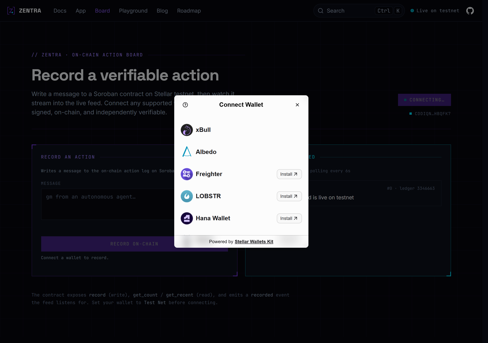 |

---

## Stellar Orange Belt — Reputation via inter-contract calls (`/board` v2)

The Action Board is now a **two-contract system**. Each `record` writes the action
**and makes a cross-contract call** to a separate Reputation contract that tracks a
per-author score — Zentra's "verifiable action receipts → reputation" thesis, on-chain.

- **Live:** https://zentra-docs.vercel.app/board
- **Action Log contract:** [`CCSXFTQTWVSHUMH2C64RJKY7JKCVHD5REFIW3P3YPVY6PWHVSJ7ZDDES`](https://stellar.expert/explorer/testnet/contract/CCSXFTQTWVSHUMH2C64RJKY7JKCVHD5REFIW3P3YPVY6PWHVSJ7ZDDES)
- **Reputation contract:** [`CA2QOMGVQ5XWGFDYT5XEJ7EQ6B6H4ZNDAPS337P3BT55XY3DJY4AIIPI`](https://stellar.expert/explorer/testnet/contract/CA2QOMGVQ5XWGFDYT5XEJ7EQ6B6H4ZNDAPS337P3BT55XY3DJY4AIIPI)
- **Cross-contract interaction tx:** [`fd503072…0da8587`](https://stellar.expert/explorer/testnet/tx/fd50307244f94bc070fe8b2d84280b992781b2c7295dc5272d17bd1650da8587) — one transaction, two contracts, two events (`bumped` + `recorded`).

### Architecture

```
record(author, message)                       [zentra-action-log]
  │  author.require_auth()
  │  store entry + bump global count
  └─▶ reputation.bump(self, author) ─────────▶ [zentra-reputation]
        (self = current contract address)        logger.require_auth()  ← only the
                                                  registered Action Log may bump
        new score  ◀───────────────────────────  score[author] += 1; emit `bumped`
  store score in entry; emit `recorded`
```

The Reputation contract gates `bump` to the registered logger. Soroban auto-authorizes
a contract for the direct cross-contract calls it makes, so `logger.require_auth()`
passes only when the Action Log is the caller.

### Level 3 requirements → where they live

| Requirement | Implementation |
| --- | --- |
| Advanced smart contracts | `contracts/zentra-reputation` — constructor, admin, gated writes |
| Inter-contract communication | `zentra-action-log::record` → `ReputationClient::bump` (`#[contractclient]`) |
| Event streaming & real-time | `src/components/app/action-feed.tsx` polls Soroban RPC `getEvents` |
| CI/CD pipeline | `.github/workflows/ci.yml` — contract + frontend jobs |
| Contract deployment workflow | `contracts/deploy.sh` — build → deploy → wire both contracts |
| Mobile responsive frontend | `/board` grid stacks on small screens |
| Error handling & loading states | `errors.ts`, `tx-status.tsx`, feed loading / empty / error states |
| Tests (contract + frontend) | 5 + 3 Rust unit tests; 10 Vitest tests (`bun run test`) |
| Production architecture | typed libs, single-source config, CI, size-optimized wasm |

### Build, test, deploy

```bash
# contracts
cd contracts/zentra-reputation && cargo test && cd -
cd contracts/zentra-action-log && cargo test && cd -
SOURCE=<your-identity> ./contracts/deploy.sh   # builds, deploys, and wires both

# frontend
bun run test     # Vitest
bun run build
```

### Screenshots

| Mobile responsive | CI/CD running | Tests passing |
| --- | --- | --- |
| 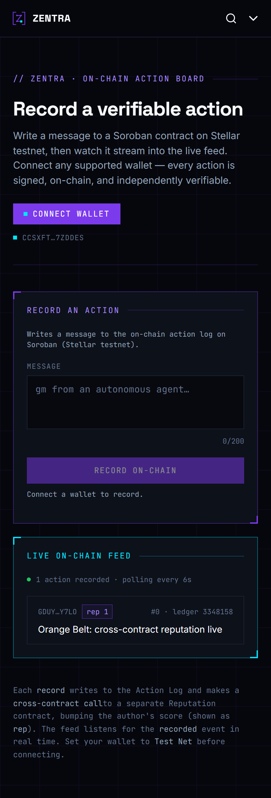 | 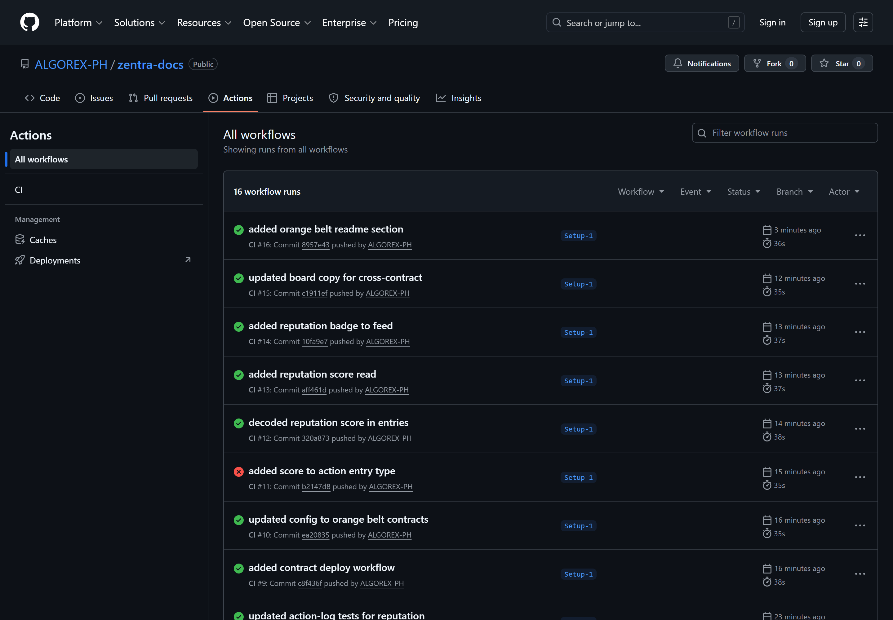 | 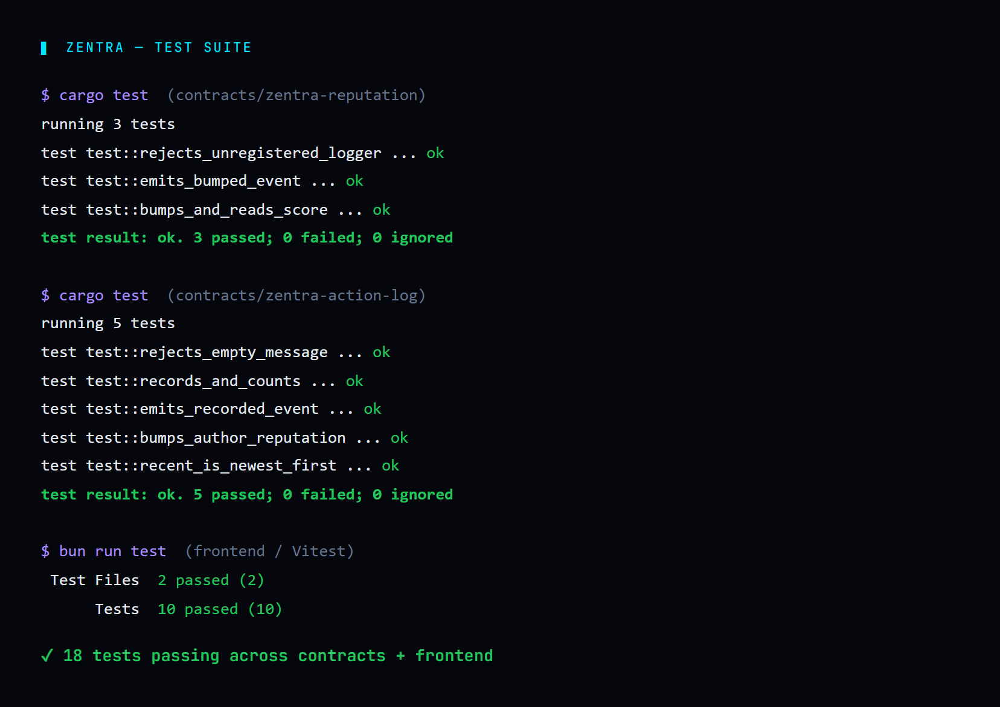 |

### Demo video

📹 _Add your 1–2 minute walkthrough link here._

---

## Stellar Green Belt — Production MVP (analytics + feedback + metrics)

The product layer on top of the contracts: real analytics, a hybrid feedback
system, and a live metrics dashboard.

- **Live:** [`/metrics`](https://zentra-docs.vercel.app/metrics)
- **Feedback contract:** [`CC6S6CKPWKUUH6NDLAENAGBN3EBZNO4GXZ7SLIJ4O3OK2I6U6K5F4CUG`](https://stellar.expert/explorer/testnet/contract/CC6S6CKPWKUUH6NDLAENAGBN3EBZNO4GXZ7SLIJ4O3OK2I6U6K5F4CUG)
- **Feedback tx:** [`ab45f5b8…dc18a0`](https://stellar.expert/explorer/testnet/tx/ab45f5b8705b4f66769edd95a0bd5469884ed1ffa45935f8c4cee9dfdedc18a0)

### Architecture

```
Frontend (Next.js on Vercel)
  ├─ Vercel Web Analytics + Speed Insights         usage + Core Web Vitals
  ├─ /metrics dashboard                            on-chain stats + feedback summary
  ├─ /api/feedback  ─────▶  Neon Postgres          feedback index + fast summaries
  └─ feedback form  ─────▶  zentra-feedback (chain) verifiable; also indexed in Neon
On-chain (Soroban testnet)
  └─ action-log → reputation (cross-contract) · feedback
```

**Hybrid feedback:** every submission is saved to **Neon Postgres** (fast
summaries, no wallet required) and, when a wallet is connected, **also anchored
on-chain** to the `zentra-feedback` contract with the tx hash stored alongside —
both queryable and independently verifiable.

### Level 4 requirements → where they live

| Requirement | Implementation |
| --- | --- |
| Production-ready MVP | live `/app`, `/board`, `/metrics` on Vercel |
| Mobile responsive | every route stacks on small screens |
| Loading & error states | every data component (feed, balance, feedback, metrics) |
| Analytics & monitoring | Vercel Web Analytics + Speed Insights (`src/app/layout.tsx`) + `/metrics` |
| User feedback + summary | `/api/feedback` (Neon) + `zentra-feedback` contract + `feedback-summary.tsx` |
| Proof of wallet interactions | `/metrics` reads distinct wallets + total actions live from chain |
| Backend architecture | Next.js route handler + Neon serverless Postgres (`src/lib/db.ts`) |
| Documentation | this README + [`docs/BELT-CHECKLIST.md`](docs/BELT-CHECKLIST.md) |

### Backend setup

Create a Neon Postgres database with a `feedback` table, then set `DATABASE_URL`
locally (`.env.local`) and in the Vercel project env. The feedback API
(`src/app/api/feedback/route.ts`) reads it at request time.

### Screenshots

| Product UI | Metrics & analytics | Mobile responsive |
| --- | --- | --- |
| 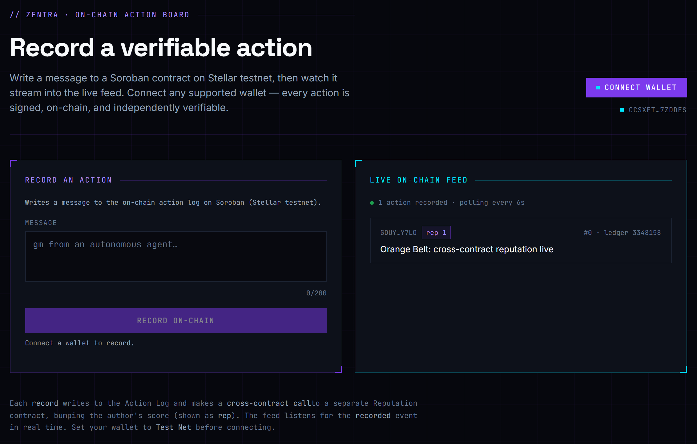 | 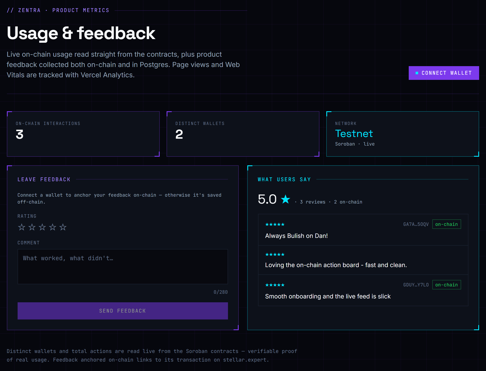 |  |

### Real users & feedback

`/metrics` shows **distinct interacting wallets** and **total on-chain actions**,
read live from the contracts — verifiable, non-fabricated proof of usage. As real
users connect and record actions or leave on-chain feedback, those numbers and the
feedback summary update automatically.

### Demo video

📹 _Add your 1–2 minute walkthrough link here._

---

## Proof Playground — real Groth16 proofs (`/playground`)

[`/playground`](https://zentra-docs.vercel.app/playground) generates an **actual
Groth16 / BN254 proof** of the Zentra payment-policy circuit (Circom + snarkjs)
**entirely in your browser**, in a Web Worker — then verifies it locally and lets
you **anchor it on-chain**.

- **Real proof:** `public/zk/` ships the circuit `.wasm` + proving `.zkey` + vk;
  `src/lib/zk/prover.ts` + `public/zk-worker.js` run `groth16.fullProve` +
  `groth16.verify` off the main thread (~3 s prove, ~0.4 s verify, 14 public signals).
- **On-chain registry:** [`CBSGDR6WBOXHSRPDHOHY24DFHIJACY3DAK2MRRO6MLFRK7YUUBSNTSHS`](https://stellar.expert/explorer/testnet/contract/CBSGDR6WBOXHSRPDHOHY24DFHIJACY3DAK2MRRO6MLFRK7YUUBSNTSHS) — connect a wallet to `anchor` your proof's SHA-256 commitment on Stellar testnet; the live feed shows every proof made on the platform (prover · signals · ledger).
- **Beginner visual guide:** a plain-English intro, an animated proof-flow pipeline, a private-vs-public split, a one-way commitment diagram, and a Merkle-tree membership visual — plus **annotated public signals** (tap to learn what each one reveals), a "what this proves vs what stays secret" panel, and a tap-to-expand ZK glossary.

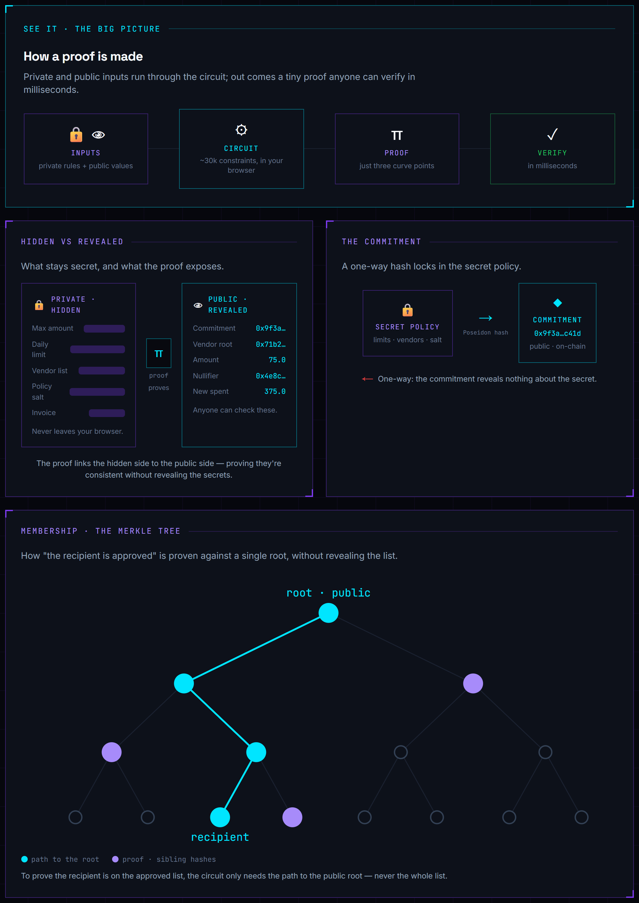

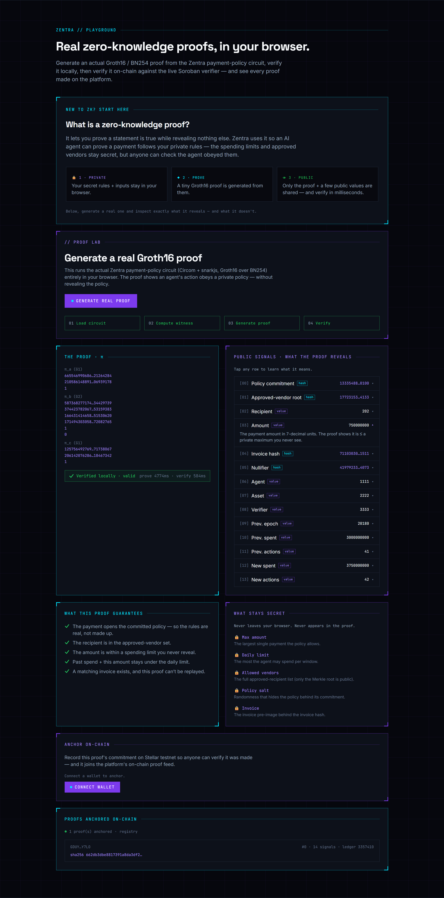

_A real proof being anchored on-chain through Freighter:_

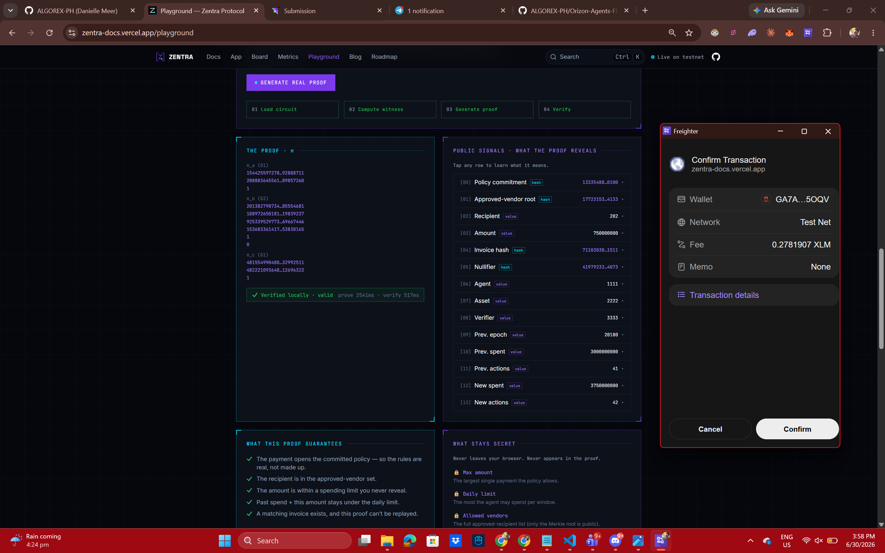

> Note: the proof is generated and verified **client-side** (real snarkjs
> verification), then anchored on-chain. On-chain *pairing re-verification*
> against the live verifier is a roadmap item — the deployed verifier's verifying
> key predates the current circuit build, and rebuilding it is gated on the
> `soroban_poseidon` host-function dependency.

---

## The rest of the site

Marketing landing, full developer documentation, an interactive proof playground,
a blog/changelog, and a roadmap.

### Stack

- [Next.js 16](https://nextjs.org) (App Router) + [Fumadocs 16](https://fumadocs.dev)
- Tailwind CSS v4, MDX content, Orama search
- [@stellar/stellar-sdk](https://github.com/stellar/js-stellar-sdk) +
  [@creit.tech/stellar-wallets-kit](https://github.com/Creit-Tech/Stellar-Wallets-Kit) for the dApp
- [Bun](https://bun.sh) for install and scripts
- Deploys on Vercel

### Develop

```bash
bun install     # also generates the .source content index
bun run dev     # http://localhost:3000
bun run build   # production build
```

### Structure

```
content/docs/                 # MDX documentation (Start Here, Concepts, Guides, Reference…)
src/app/(home)/app/           # the Stellar testnet dApp route
src/app/(home)/               # landing, playground, blog, roadmap
src/app/docs/                 # docs renderer
src/components/app/           # wallet provider + dApp UI (connect, balance, send, status)
src/components/brand/         # the Proof Gate · Z-Path mark
src/components/landing/       # landing sections
src/lib/stellar/              # Wallets Kit, Horizon client, account, payment, errors
src/config/protocol.ts        # single source of truth for live protocol facts
src/config/stellar.ts         # testnet endpoints for the dApp
```

### Live facts

The current testnet contract id, RPC, asset, and CPU-budget figure live in
`src/config/protocol.ts`. Every surface reads from there, so a redeploy updates
the whole site at once — no contract id is hardcoded in prose.

## Related

- Protocol source and the product spec live in the `zentra-protocol` repository.
