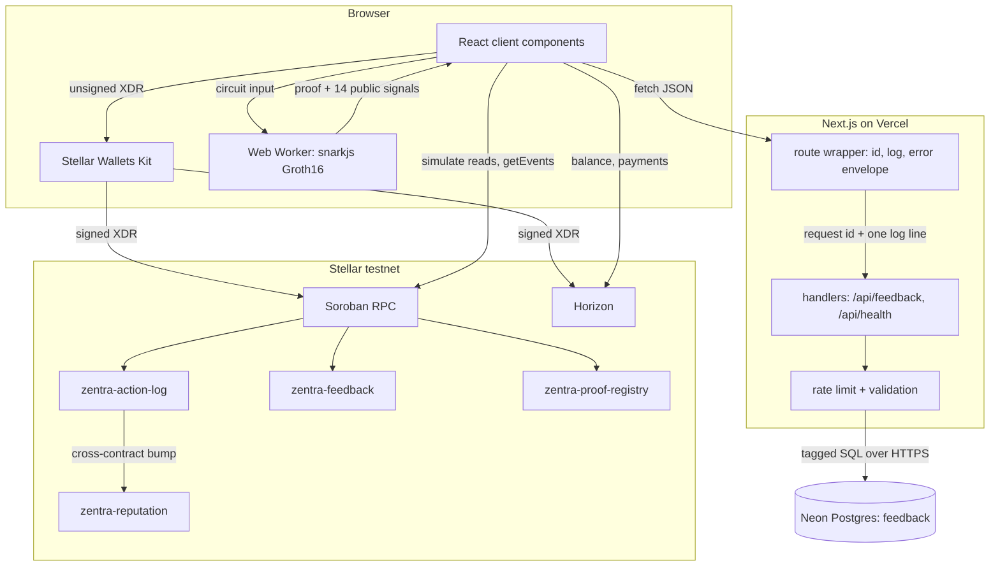

# Zentra Docs — Architecture

## 1. Overview

This repository is one deployable product: a Next.js 16 App Router application
that serves the Zentra Protocol documentation site, the landing page, and a
working Stellar dApp from the same build. It spans three tiers — a browser tier
(React client components, the Stellar Wallets Kit, and a snarkjs Groth16 prover
running in a Web Worker), a serverless tier (Next route handlers on Vercel
talking to Neon Postgres over its HTTP driver), and a chain tier (four Soroban
contracts deployed on Stellar testnet, reached directly from the browser via
Soroban RPC and Horizon).

The browser is the only client of both the API and the chain. There is no
server-side wallet, no server-side signing, and no backend indexer: everything
the server does is scoped to the feedback table and a readiness probe.

---

## 2. System diagram

---

## 3. Layers

### 3.1 Presentation — App Router

Two route groups plus the API segment. `(home)` wraps everything in Fumadocs'
`HomeLayout` (`src/app/(home)/layout.tsx`); `docs` uses `DocsLayout` with the
generated page tree (`src/app/docs/layout.tsx`); `src/app/api` has no layout.

| Route | File | Rendering |
| --- | --- | --- |
| `/` | `src/app/(home)/page.tsx` | Server component composing landing sections |
| `/app` | `src/app/(home)/app/page.tsx` | Client — connect, balance, send XLM |
| `/board` | `src/app/(home)/board/page.tsx` | Client — record action, live event feed |
| `/metrics` | `src/app/(home)/metrics/page.tsx` | Client — on-chain stats, feedback form + summary |
| `/playground` | `src/app/(home)/playground/page.tsx` | Server shell, client proof lab inside |
| `/blog` | `src/app/(home)/blog/page.tsx` | Server, static content in TSX |
| `/roadmap` | `src/app/(home)/roadmap/page.tsx` | Server, static content in TSX |
| `/docs/[[...slug]]` | `src/app/docs/[[...slug]]/page.tsx` | Server, `generateStaticParams` over the MDX source |
| `/api/feedback` | `src/app/api/feedback/route.ts` | `GET` + `POST`, Node runtime, `force-dynamic` |
| `/api/health` | `src/app/api/health/route.ts` | `GET`, Node runtime, `force-dynamic` |
| `/api/search` | `src/app/api/search/route.ts` | `GET`, Fumadocs/Orama `createFromSource` |
| `/sitemap.xml`, `/robots.txt` | `src/app/sitemap.ts`, `src/app/robots.ts` | Metadata routes |

The server/client split follows one rule: a component is a client component
only if it touches the wallet, the chain, snarkjs, or local UI state. Every
landing section, the ZK visual guide (`viz-*.tsx`, `zk-intro.tsx`,
`what-this-proves.tsx`) and the docs pages are server components.

`WalletProvider` (`src/components/app/wallet-provider.tsx`) is mounted per
route, in `app/layout.tsx`, `board/layout.tsx`, `metrics/layout.tsx` and
`playground/layout.tsx` — not in the root layout — so docs and landing pages
never load wallet code. It holds the connected address, persists
`{walletId, address}` to `localStorage` under `zentra:wallet`, rehydrates on
mount, and exposes `signTransaction`.

Failure and loading surfaces are explicit: `(home)/loading.tsx` (skeleton),
`(home)/error.tsx` (segment boundary; renders `error.digest`, never
`error.message`), `src/app/global-error.tsx` (root-layout boundary with its own
`<html>` and no `@/components` imports), and `src/app/not-found.tsx`.

Documentation content is 34 MDX files under `content/docs/`, compiled by
`fumadocs-mdx` into `.source` and loaded through `src/lib/source.ts`.

### 3.2 API

Every JSON route is defined through one wrapper, `route(name, handler)` in
`src/lib/api/route.ts`. The wrapper — not the handler — guarantees:

- **A request id on every response.** An inbound `x-request-id` is echoed when
  non-empty and ≤ 200 characters, otherwise `newRequestId()` mints one.
  `withRequestId` clones the response if its headers are immutable.
- **Exactly one structured log line per request** (`event: "request"`) carrying
  `name`, `method`, `status`, `durationMs`, `requestId`, and on failure `code`.
- **A single error envelope.** Anything thrown reaches one catch site;
  `toErrorBody` converts it. The catch site has its own catch that emits a
  hand-written JSON 500 with no dependencies, so error handling cannot itself
  throw.

`json()` in the same module defaults to `cache-control: no-store` and lets a
handler override it.

**Error vocabulary** — `src/lib/api/errors.ts`. `ApiError` carries a status, a
stable machine code (`bad_request`, `validation_failed`, `rate_limited`,
`not_found`, `method_not_allowed`, `conflict`, `payload_too_large`,
`upstream_unavailable`, `internal`), optional per-field `details` and an
optional `retryAfterSeconds` that becomes a `Retry-After` header. `isApiError`
checks structurally as well as by prototype so duplicate module copies across
bundler boundaries do not break `instanceof`. The module imports nothing from
Next, so it is unit-testable under plain Node.

**Validation boundary** — `src/lib/api/validation.ts`. `readJsonBody` rejects a
body over 4096 bytes twice: first against `content-length`, then against the
measured UTF-8 length of the decoded text. `parseFeedbackInput` accumulates
every field error and throws one 422 listing all of them, normalises the
comment (whitespace runs collapsed, ASCII control characters stripped, trimmed),
lowercases `txHash` to match the database CHECK, downgrades `onChain` to false
when no valid `txHash` backs it, and rebuilds the value key by key so no
caller-supplied extra field reaches the database.

**Rate limiting** — `src/lib/api/rate-limit.ts`. Fixed-window counters in a
`Map` held on `globalThis` under `Symbol.for('zentra.api.rate-limit.store')`
(a module-level `const` would be reset by dev hot reload). Bucket key is
`scope:ip`, where the IP is the first hop of `x-forwarded-for`, else
`x-real-ip`, else `cf-connecting-ip`, else `unknown`. The map is capped at 5000
keys with pruning of expired then soonest-to-expire entries. Limits today:
`feedback:read` 60/60 s, `feedback:write` 5/10 min; `/api/health` is not limited.

**Logging** — `src/lib/api/logger.ts`. One JSON object per line
(`{ts, level, event, ...fields}`) written to the matching `console` method, which
is what Vercel's log drain parses. `debug` is dropped in production. `Error`
values are normalised to `{name, message}` (plus `stack` outside production).
Serialisation failure degrades to a minimal line rather than throwing.

**Client helper** — `src/lib/api/client.ts` unwraps the envelope in the browser.
`readApiError` never throws and falls back to a caller-supplied string for any
body that is not the envelope (HTML error pages, empty bodies, proxy responses).

### 3.3 Data

`src/lib/db.ts` exposes `sql()`, a lazily created `@neondatabase/serverless`
client. `DATABASE_URL` is read at call time, not import time, so the module can
be imported during a build with no database configured; the scheme is validated
and the value is never quoted in an error message. `hasDatabase()` reports
configuration without connecting.

There is no connection pool. The Neon HTTP driver makes each tagged query a
single stateless HTTPS round trip, which is the right shape for a function that
may be frozen between requests — there is no idle connection to keep alive or
drain. The read path in `src/app/api/feedback/route.ts` issues its two
statements under `Promise.all` to halve the round trips it waits on.

`db/schema.sql` is the single source of truth for the schema: one `feedback`
table with named CHECK constraints (rating 1–5, comment length 1–280, `wallet`
matching `^G[A-Z2-7]{55}$`, `tx_hash` matching `^[0-9a-f]{64}$`, and
`NOT on_chain OR tx_hash IS NOT NULL`), plus four indexes — a `created_at DESC`
index for the recent list, a partial index on `tx_hash WHERE on_chain`, a
partial index on `wallet`, and a **unique** partial index on
`tx_hash WHERE tx_hash IS NOT NULL` whose violation (Postgres `23505`) is what
the API turns into a 409. `db/migrations/001_harden_feedback.sql` retrofits the
same constraints `NOT VALID` onto a database created before they existed.

The API layer and the database enforce the same rules independently: validation
exists to produce a useful 422, the constraints exist so a bug in that layer
cannot corrupt the table.

### 3.4 Chain

All chain access is from the browser. `src/lib/stellar/` splits by concern:

| File | Role |
| --- | --- |
| `kit.ts` | Initialises `StellarWalletsKit` once (testnet, Freighter default) with the Freighter, xBull, Albedo, LOBSTR, Hana and Rabet modules; throws during SSR |
| `client.ts` | One `Horizon.Server` for classic operations |
| `rpc.ts` | One `rpc.Server` for Soroban simulate/submit/`getEvents` |
| `account.ts` | XLM balance (`null` when the account does not exist) and Friendbot funding |
| `payment.ts` | Builds an unsigned native-XLM payment XDR, submits the signed XDR to Horizon |
| `action-log.ts` | `simulateRead` helper, `get_count`/`get_recent`/`score_of` reads, `buildRecordXdr`, `submitInvoke`, `getLatestLedger`, `pollEvents` |
| `feedback.ts` | `buildFeedbackXdr`, `getFeedbackCount`, `getFeedbackAuthors` |
| `proofs.ts` | `commitProof` (SHA-256 over 32-byte big-endian public signals), `buildAnchorXdr`, proof reads |
| `errors.ts` | Maps wallet rejections and Horizon `result_codes` to human messages |
| `format.ts` | Address truncation, key/amount validation, XLM formatting |
| `types.ts` | `TxPhase`/`TxState` lifecycle plus `ActionEntry`, `ProofEntry`, `PaymentResult` |

The write path is the same in every case: load the source account, build the
invoke with `BASE_FEE`, `simulateTransaction`, bail on
`Api.isSimulationError`, `assembleTransaction(...).build().toXDR()`, hand the
XDR to the wallet, then `submitInvoke` — which sends and polls `getTransaction`
up to 30 times at 1 s intervals until `SUCCESS`. Reads never sign: `simulateRead`
builds a throwaway transaction from a funded read-only source account
(`actionLog.readSource` in `src/config/contract.ts`) purely so the RPC has
something to simulate.

Event streaming is polling, not a socket: `ActionFeed` seeds from
`get_recent` + `get_count` + `getLatestLedger`, then calls `pollEvents(cursor)`
every 6 s, dedupes incoming entries by index, and advances the cursor to
`latestLedger + 1`.

Contract ids and endpoints are centralised — `src/config/contract.ts` (the four
deployed contracts and the read source), `src/config/stellar.ts` (Horizon, RPC,
Friendbot, passphrase, Stellar Expert URL builders) and `src/config/protocol.ts`
(live protocol facts surfaced in docs prose).

### 3.5 ZK

The circuit is the Zentra payment-policy circuit, Groth16 over BN254. Its
artifacts ship as static assets in `public/zk/`: `payment_policy.wasm` (3.3 MB),
`payment_policy.zkey` (2.3 MB), `verification_key.json`
(`"protocol": "groth16"`, `"curve": "bn128"`, `"nPublic": 14`),
`input.example.json`, and a UMD `snarkjs.min.js` (0.7 MB). The circuit source
itself is not in this repository.

`src/lib/zk/prover.ts` spawns `public/zk-worker.js` — a classic Web Worker that
`importScripts` snarkjs and runs `groth16.fullProve` followed by
`groth16.verify` against the shipped verifying key, timing both. Proving takes
seconds, so running it off the main thread is what keeps the page responsive;
the private witness never leaves the browser. `ProofLab` advances a stage
indicator while the worker runs but the result is real — it never fabricates a
proof, and a worker error is surfaced verbatim.

Anchoring is a commitment, not on-chain verification: `commitProof` SHA-256s the
public signals (each as 32 bytes, big-endian) and `buildAnchorXdr` records that
32-byte digest plus the signal count on the proof registry contract. That binds
the on-chain record to one specific proof without storing the proof on-chain.
`src/lib/zk/education.ts` holds the annotated list of the 14 public signals, the
private inputs, and the glossary rendered on `/playground`.

---

## 4. Contracts

Four Rust contracts under `contracts/`, each `#![no_std]` on `soroban-sdk`
26.1.0, all deployed to Stellar testnet. Addresses below are taken from
`docs/BELT-CHECKLIST.md`, `README.md` and `src/config/contract.ts`, which agree.

| Contract | Source | Purpose | Testnet address |
| --- | --- | --- | --- |
| Action Log v2 | `contracts/zentra-action-log` | `record(author, message)` — `require_auth`, validates 1–200 chars, stores an `Entry`, bumps a global count, cross-contract-calls the reputation contract, emits `recorded`. Reads: `get_count`, `get_entry`, `get_recent` (capped at 20) | `CCSXFTQTWVSHUMH2C64RJKY7JKCVHD5REFIW3P3YPVY6PWHVSJ7ZDDES` |
| Reputation | `contracts/zentra-reputation` | `bump(logger, author)` — admin-set single authorised logger, `logger.require_auth()` plus a registered-address equality check; increments and returns the score, emits `bumped`. Read: `score_of` | `CA2QOMGVQ5XWGFDYT5XEJ7EQ6B6H4ZNDAPS337P3BT55XY3DJY4AIIPI` |
| Feedback | `contracts/zentra-feedback` | `submit(author, rating, comment)` — `require_auth`, validates rating 1–5 and comment 1–280, keeps a running count and rating sum, emits `feedback`. Reads: `get_count`, `summary`, `get_recent` | `CC6S6CKPWKUUH6NDLAENAGBN3EBZNO4GXZ7SLIJ4O3OK2I6U6K5F4CUG` |
| Proof Registry | `contracts/zentra-proof-registry` | `anchor(prover, commitment, signals)` — `require_auth`, stores a `BytesN<32>` commitment with the public-signal count and ledger, emits `anchored`. Reads: `get_count`, `get_recent` | `CBSGDR6WBOXHSRPDHOHY24DFHIJACY3DAK2MRRO6MLFRK7YUUBSNTSHS` |

Storage discipline is identical across all four: instance storage for counters
and wiring with a 30-day TTL bump, persistent storage for entries with a 90-day
bump, and `get_recent` capped at 20 to bound the read.

Two addresses referenced elsewhere that are **not** in this table:

- `CDDIQNNCZ23UVM4FTEKNFUB72WHNASWOX2JRXED3HYK6FNZGZCHBQFK7` — the Yellow Belt
  action-log v1, superseded by v2 and recorded in `docs/BELT-CHECKLIST.md` and
  `README.md` for provenance only.
- `CDS6BURFWRTU6FXN6IXOSKOIAZ4PX7XJ6U5FSI345XX3O5FGP7U3K7VY` — the ZentraVerifier
  in `src/config/protocol.ts`, used for the "Live on testnet" nav link and docs
  prose. Its source lives in the separate `zentra-protocol` repository; there is
  no verifier source or deployment script in this repo, and nothing in this app
  invokes it.

`contracts/deploy.sh` builds, deploys and wires reputation + action log
(including `set_logger`) and prints the ids to paste into
`src/config/contract.ts`. The feedback and proof-registry contracts were
deployed outside that script.

---

## 5. Request lifecycle — `POST /api/feedback`

A user on `/metrics` with a connected wallet submits a 5-star review.

1. **Click.** `FeedbackForm` (`src/components/app/feedback-form.tsx`) guards
   locally: rating 1–5, comment non-empty and ≤ 280 characters. Status moves to
   `sending`.
2. **Build the invoke.** Because `address` is set, `buildFeedbackXdr(address,
   rating, comment)` (`src/lib/stellar/feedback.ts`) loads the account through
   `soroban.getAccount`, builds a `submit` call at `BASE_FEE` with a 60 s
   timeout, runs `soroban.simulateTransaction`, throws on
   `Api.isSimulationError`, and returns
   `assembleTransaction(tx, sim).build().toXDR()`.
3. **Sign.** `signTransaction(xdr)` from `useWallet` calls
   `StellarWalletsKit.signTransaction` with the testnet passphrase. The user
   approves in Freighter (or any of the five other supported wallets). A
   decline throws and is caught at step 10.
4. **Submit.** `submitInvoke(signed)` (`src/lib/stellar/action-log.ts`) rebuilds
   the transaction from XDR, calls `soroban.sendTransaction`, then polls
   `soroban.getTransaction` up to 30 times at 1 s until `SUCCESS`, returning the
   hash.
5. **On-chain.** `Feedback::submit` runs `author.require_auth()`, validates the
   rating and comment, writes the `Entry` to persistent storage with a TTL
   extension, increments `Count` and `RatingSum`, and publishes the `feedback`
   event.
6. **POST.** The browser sends
   `{rating, comment, wallet, txHash, onChain: true}` to `/api/feedback` as JSON.
7. **Wrapper.** `route('feedback.create', …)` resolves the request id (echo the
   inbound `x-request-id` if ≤ 200 characters, else mint one) and starts the
   duration timer.
8. **Rate limit.** `enforceRateLimit(request, 'feedback:write', {limit: 5,
   windowMs: 600000})` derives `feedback:write:<ip>` via `clientKey` and counts
   the hit. Over budget throws `rateLimited(retryAfterSeconds)` → 429 with
   `Retry-After`; within budget it returns the `X-RateLimit-*` headers to attach
   to the success response.
9. **Parse and validate.** `readJsonBody` enforces the 4096-byte ceiling twice
   and rejects an empty or non-JSON body with 400. `parseFeedbackInput` rejects
   a non-object body with 400, collects all field failures into one 422,
   normalises the comment, lowercases `txHash`, and rebuilds the object field by
   field.
10. **Insert.** `insertFeedback` calls `sql()` and runs one parameterised
    `INSERT` over the Neon HTTP driver. Postgres `23505` from the unique partial
    index becomes `conflict('This transaction has already been recorded.')` →
    409; any other driver error is logged as `feedback.write` and replaced with
    `upstreamUnavailable(…)` → 503, so no driver message or connection string
    reaches the client.
11. **Log and respond.** `log('info', 'feedback.created', {requestId, rating,
    onChain, wallet, txHash})` — wallet and hash are public chain data, so the
    log line is traceable to the ledger. The handler returns
    `json({ok: true}, {status: 201, headers})`; the wrapper writes its single
    `request` line and sets `x-request-id` on the way out.
12. **Client.** A non-2xx response is unwrapped by `readApiError` and rendered
    inline. On success the form clears and calls `onSubmitted`, which bumps the
    `refresh` counter on `/metrics`, re-running `MetricsStats` (chain reads) and
    `FeedbackSummary` (`GET /api/feedback`).

With no wallet connected, steps 2–5 are skipped, `txHash` is `null`, and
`onChain` is downgraded to `false` at step 9 — the row is stored off-chain.

---

## 6. Cross-cutting concerns

**Security headers** (`next.config.mjs`, applied to `/:path*`):

| Header | Value |
| --- | --- |
| `Strict-Transport-Security` | `max-age=63072000; includeSubDomains; preload` |
| `X-Content-Type-Options` | `nosniff` |
| `X-Frame-Options` | `DENY` |
| `Content-Security-Policy` | `frame-ancestors 'none'` |
| `Referrer-Policy` | `strict-origin-when-cross-origin` |
| `Permissions-Policy` | `camera=(), microphone=(), geolocation=(), payment=()` |

`poweredByHeader` is disabled and `reactStrictMode` is on. A full `script-src`
policy is deliberately absent, and the file says why: the Groth16 witness runs
as WebAssembly in a Web Worker and needs `wasm-unsafe-eval`, and Next injects
inline bootstrap scripts, so a strict policy without a nonce pipeline would
break proving in production.

**Input validation.** Enforced twice and independently — in
`src/lib/api/validation.ts` to produce an actionable 422, and in `db/schema.sql`
as named CHECK constraints so a bug in the first layer cannot corrupt the table.
Client-side checks in the forms exist for UX only and are re-done server-side.

**Secret redaction.** `redact()` in `src/lib/api/logger.ts` masks any field whose
*key* matches `secret|token|password|key|authorization|cookie|database_url|
connection` (case-insensitive). Matching is by key name and is not recursive.
`sql()` never quotes `DATABASE_URL` in its errors.

**No-leak error envelope.** `toErrorBody` returns
`{error: {code, message, details?}}` for an `ApiError` and collapses everything
else to a fixed `{code: "internal", message: "Internal server error."}` 500 —
message and stack are withheld because they routinely quote the failing
statement and the connection target. `/api/health` applies the same principle
from the other direction: it degrades to 503 with the fixed string
`unavailable` and logs the real cause under the same `requestId`.

**Testing.**

| Suite | Scope | Count |
| --- | --- | --- |
| Vitest (`vitest.config.ts`, node environment, `@` alias) | `src/lib/api/{auth,client,errors,logger,moderation,rate-limit,validation,verify-anchor}` and `src/lib/stellar/{errors,format}` | 201 tests in 10 files, verified passing |
| `cargo test` | `zentra-action-log` 5, `zentra-reputation` 3, `zentra-feedback` 4, `zentra-proof-registry` 2 | 14 `#[test]` functions; each contract also carries Soroban test snapshots |

**CI** (`.github/workflows/ci.yml`, on every push and pull request, permissions
`contents: read`): a `contracts` job (Rust stable, cargo cache, `cargo test` for
reputation then action-log) and a `frontend` job (Bun, `bun install`,
`bun run types:check` → `fumadocs-mdx && next typegen && tsc --noEmit`,
`bun run test`, `bun run build` with telemetry disabled). The two jobs run in
parallel and there is no deploy step in the workflow.

---

## 7. Deployment

Vercel, from this repository, with Bun as the package manager. `postinstall`
runs `fumadocs-mdx` so the `.source` content index exists before the build.
`@vercel/analytics` and `@vercel/speed-insights` are mounted in
`src/app/layout.tsx`. API routes pin `runtime = 'nodejs'` and
`dynamic = 'force-dynamic'`.

Environment variables the code actually reads (`process.env.` across `src/`,
`next.config.mjs` and `source.config.ts`):

| Variable | Read in | Required | Purpose |
| --- | --- | --- | --- |
| `DATABASE_URL` | `src/lib/db.ts` | Yes, at request time | Neon connection string; must match `postgres(ql)://`. Absent → `/api/feedback` returns 503 and `/api/health` reports degraded |
| `NODE_ENV` | `src/lib/api/logger.ts` | Set by the platform | Drops `debug` logs and strips stack traces in production |
| `NEXT_PUBLIC_SITE_URL` | `src/lib/site.ts` | No | Canonical origin for metadata, sitemap and robots |
| `VERCEL_PROJECT_PRODUCTION_URL` | `src/lib/site.ts` | Set by the platform | Fallback origin; final fallback is `https://docs.zentra.dev` |
| `NEXT_TELEMETRY_DISABLED` | `.github/workflows/ci.yml` | CI only | Disables Next telemetry during the CI build |

No API keys, wallet secrets or RPC credentials are read anywhere: Horizon,
Soroban RPC and Friendbot are public testnet endpoints hardcoded in
`src/config/stellar.ts`. Contract ids are compile-time constants in
`src/config/contract.ts`, not environment variables.

The database is provisioned by applying `db/schema.sql` (and, on an existing
database, `db/migrations/001_harden_feedback.sql`) with `psql`. There is no
migration runner in the application.

---

## 8. Design decisions

**In-memory rate limiter.** *Why:* the limiter must not add an infrastructure
dependency for a testnet MVP, and a fixed-window `Map` gives immediate spam
protection with zero setup and full unit-testability. *Trade-off:* counters are
per instance, so the real ceiling is roughly `limit × instances` and an instance
that scales to zero forgets everything. Documented in the module header, in
`docs/API.md` and in §9 below; the fix when traffic justifies it is a shared
store such as Redis or Upstash.

**`force-dynamic` + Node runtime on API routes.** *Why:* every response depends
on request-time state — the database, the caller's IP bucket, a per-request id —
and the Neon driver plus `process.uptime()` want the Node runtime. Prerendering
would be wrong at any cache level. *Trade-off:* no static optimisation and a
cold-start cost per instance; the read route claws back most of it with
`public, s-maxage=30, stale-while-revalidate=120` at the CDN, which the wrapper
allows because handler-supplied headers beat the `no-store` default.

**ZK proving in the browser.** *Why:* the witness contains the private policy
and salts, so it should never leave the user's machine, and browser proving
means no GPU-shaped server tier to run or pay for. A Web Worker keeps the
multi-second `fullProve` off the main thread. *Trade-off:* ~5.6 MB of circuit
artifacts plus a 0.7 MB snarkjs bundle are downloaded on first proof, proving
time depends entirely on the visitor's device, and the WebAssembly requirement
is what blocks a strict `script-src` CSP.

**One Next.js app, no monorepo.** *Why:* the docs, landing page, dApp,
playground and API are one product with one deploy and one set of shared
components and config; a workspace tool would add build machinery for no
separation that is actually needed. The Rust contracts stay independent cargo
crates with their own CI job. *Trade-off:* a single blast radius — a build
failure in any surface blocks all of them — and every surface shares one
dependency graph.

**Neon HTTP driver instead of a pool.** *Why:* a serverless function can be
frozen between requests, so a pool has no connections worth keeping alive;
each tagged query is one stateless HTTPS round trip, and the client is cached
only because parsing the URL is wasted work per request. *Trade-off:* no
multi-statement transactions or session state, and per-query latency instead of
an amortised connection. The GET path compensates by issuing its two statements
under `Promise.all`.

**Config as code, not environment.** *Why:* contract ids, endpoints and protocol
facts live in `src/config/*.ts`, so no id is hardcoded in prose or duplicated in
a component, and the whole site updates from one file after a redeploy.
*Trade-off:* changing a contract id needs a commit and a rebuild rather than an
environment-variable flip, and preview deployments cannot point at a different
contract without a code change.

---

## 9. Known limitations

- **Rate limiting is per instance.** In-memory fixed windows; the effective
  ceiling scales with concurrent Vercel instances and resets on scale-to-zero. A
  spam speed bump, not a security control.
- **The feedback endpoints are unauthenticated.** Anyone may submit. A `wallet`
  sent on its own is self-reported and is not proof of key ownership — only an
  anchored `txHash` is, because `src/lib/api/verify-anchor.ts` resolves it
  against Horizon and requires the transaction to exist, to have succeeded, and
  to be sourced from that same wallet before `on_chain` is set. An unproven
  claim is downgraded rather than rejected, so the feedback survives without the
  badge. Binding an unanchored `wallet` to its owner would need a signed
  challenge, which the API does not do today.
- **Tests cover pure modules only.** The Vitest suite exercises the API helpers,
  the network config and two Stellar utilities; the Rust tests cover all five
  contracts and run in CI. There are no tests for React components, route
  handlers end to end, or any browser/E2E flow, and no test touches a live
  database or the network. Exact counts are deliberately not quoted here — they
  move every time a module is added, and a stale number in a limitations section
  is worse than none.
- **No `script-src` CSP.** Only `frame-ancestors 'none'` is enforced, because
  WebAssembly proving needs `wasm-unsafe-eval` and Next emits inline bootstrap
  scripts. A nonce pipeline is the prerequisite for tightening this.
- **The `/metrics` wallet count is a lower bound.** `MetricsStats` derives
  distinct wallets from the most recent 20 action-log entries plus the most
  recent 20 feedback authors — both contract reads are capped at
  `MAX_RECENT = 20` — so older participants are not counted.
- **Event polling is best-effort.** `ActionFeed` polls `getEvents` every 6 s and
  swallows failures until the next tick, with no backoff or reconnect. The
  filter is by contract id only, not by topic, so every event that contract
  emits is decoded as an entry. Soroban RPC also retains only a limited window
  of history, so a cursor that falls too far behind cannot be recovered.
- **No caching of chain reads.** Each visit to `/board`, `/metrics` or
  `/playground` issues several `simulateTransaction` calls straight to public
  testnet RPC from the browser; there is no server-side cache or indexer in
  front of them.
- **Anchoring is a commitment, not on-chain verification.** The proof registry
  stores a SHA-256 digest of the public signals. Nothing in this repository
  re-verifies the Groth16 pairing on-chain; the deployed ZentraVerifier lives in
  the `zentra-protocol` repository and, per `README.md`, its verifying key
  predates the current circuit build.
- **`CREATE TABLE IF NOT EXISTS` will not retrofit constraints.** Re-running
  `db/schema.sql` against an existing `feedback` table adds only indexes;
  `db/migrations/001_harden_feedback.sql` exists for exactly that case and its
  constraints are added `NOT VALID` until validated manually.
- **`x-request-id` is caller-controlled.** It is echoed as sent, capped at 200
  characters — a correlation aid, not an authenticated identifier.
- **Testnet only, unaudited.** Every contract, endpoint and proof in this
  repository targets Stellar testnet.
